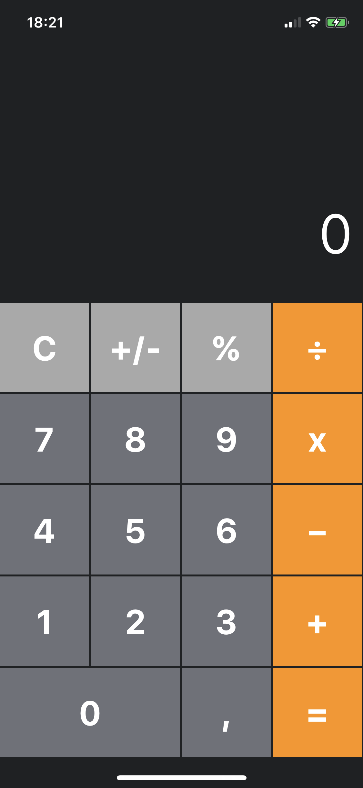
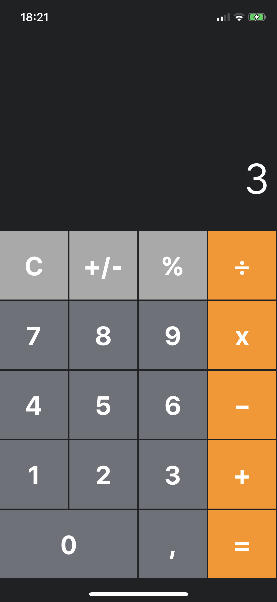
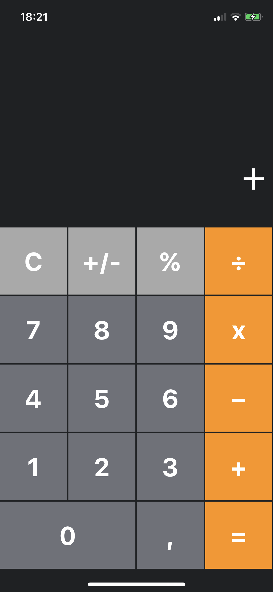
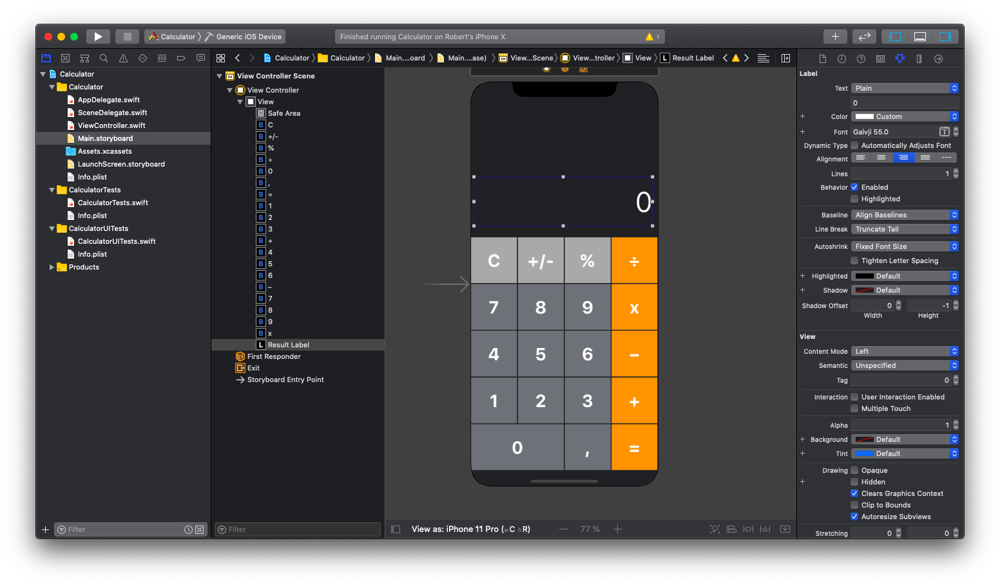

# Calculator

- This project is an implementation of the classical app Calculator in Swift for iOS.
- It was created by me using UIKit in Xcode.
- In this app I implemented most of the functionalities of a calculator for iOS.
- This is my first app developed and designed in Swift for iOS.
- I had tested this app on my iOS phone and the screenshots below are from there.

The app is typical: when the user taps on a button the corresponding action is performed. 

    
    

As I mentioned, the IDE used to develop this app is Xcode.

